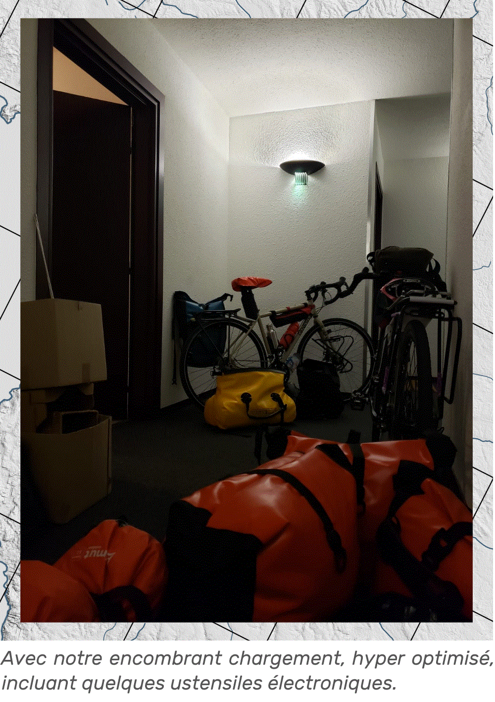
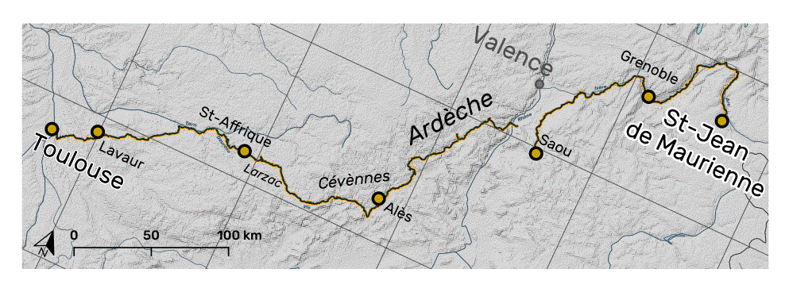
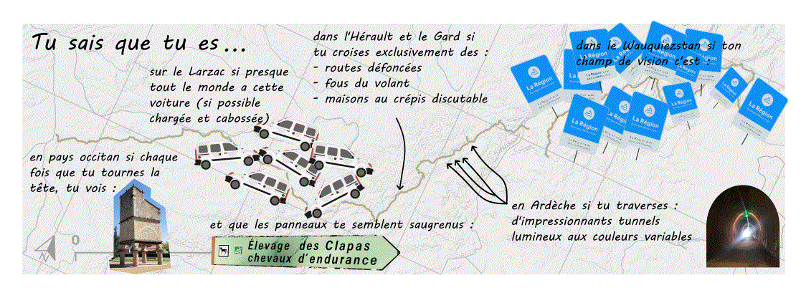
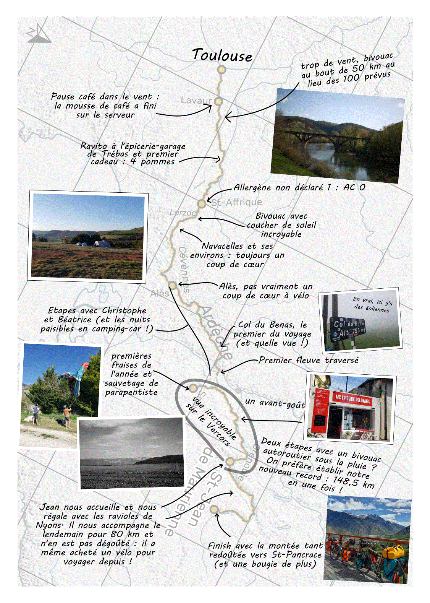

C'est avec un ~~retard considérable~~ recul nous permettant de prendre une distance que n'aurait pas permis un partage "à chaud" de notre voyage que nous entamons cette newsletter à la parution irrégulière et au contenu variable.

On avait promis qu'on raconterait notre voyage. On n'a pas menti, on s'est juste fait un peu attendre (certains diront, "attendre AC, quelle surprise, ça n'arrive jamais !") auprès de celles et ceux qui ne suivent pas nos étapes journalières sur Strava (si vous souhaitez y remédier c'est par ici ou pour les non-Strava là (un énorme merci à Claire/maman pour l'actualisation quotidienne de cette carte) et pour les instagrameur.se.s, promis ça arrive ( @velo_carto_dodo ). Il faut avouer qu'entre le pliage matin et soir des sacoches et de la tente qui nous prennent minimum 4 h/jour, la planification du trajet des jours suivants, les pauses cafés, chercher et se faire à manger et évidement le pédalage et dormir, prendre du temps pour raconter quotidiennement 25 journées en une est passé au second plan.

Voilà quelques semaines que nous avons quitté Toulouse. État des lieux de l'appartement, restitution des clés et départ à vélo, depuis le pas de notre porte. Bon ça c'est la théorie, dans les faits c'était plutôt :
1) arriver à boucler les sacoches : "punaise mais ça ne rentre pas !" 😬

​
Après avoir finalement réussi à tout faire (difficilement) rentrer dans les sacoches (la configuration sera refaite presque tous les jours de la première semaine pour être la plus optimisée possible et est actuellement changée uniquement à la marge) avec en option des oublis du déménagement comme ces incroyables moules à glaçons élans/nids d'abeille/maxi-glaçons 5*5*5 cm restés au fond du congélateur ou la bouteille de liqueur de bergamote maison qui feront la traversée de la France avec nous.
2) arriver à pédaler, si si on vous assure : nous avions choisi le jour parfait pour le départ avec un vent d'autan bien costaud qui incitait plus à rester chez soi, et puis on n'avait pas testé notre chargement au préalable (la faute à la mauvaise météo et à notre incroyable organisation) du coup, visualisez quelqu'un qui apprend à faire du vélo, un randonneur qui croule sous le poids de son chargement (si seulement il s'était inspiré des meilleurs marcheurs ultra-légers...), une lutte contre un bon vent de face, vous combinez tout ça et vous avez un aperçu de nos sensations sur les premiers kilomètres. L'avantage c'est que maintenant chaque fois que l'on a un peu de vent, on relativise !

Nos affaires de tous les jours ont, dans les semaines qui ont précédé le départ, été dispersées chez qui en a bien voulu/pu (merci à vous, vraiment). Et, finalement, après des mois à imaginer et construire ce voyage et des semaines de logistique pour le rendre possible, avec des vélos capables de nous supporter sur des milliers de kilomètres (on espère), des vêtements pour nous permettre de supporter toutes les météos, de quoi cuisiner, dormir et se divertir n'importe où, nous avons dit au revoir à Toulouse, on doit se l'avouer avec une certaine pointe de nostalgie mais surtout l'euphorie des découvertes qui nous attendent.

Le voyage à vélo c'est tous les jours la même chose, une routine de mieux en mieux rodée. Pliage des affaires, rangement des sacoches, chargement des vélos, une journée à rouler ponctuée de pauses, puis décharger les vélos, monter la tente, cuisiner, et dormir, enfin.
Mais c'est surtout tous les jours différent. S'émerveiller des paysages, rire des initiatives personnelles qui décorent les maisons, faire des pauses quand on en a envie ou besoin, des photos, des rencontres, des discussions avec les curieux (souvent d'un certain âge), cuisiner quelque chose de réconfortant avec une spécialité locale (coucou la désormais traditionnelle purée pimpée au lait en poudre et à la tomme fraîche), profiter de la nature, lire, écrire un peu et préparer la suite. C'est tout cela que l'on souhaite vous partager un peu, à notre façon.

Pour ce premier épisode, il sera question de "La Mise en Jambes", notre premier tronçon, entre Toulouse et Saint-Jean-de-Maurienne, en Savoie.

1 : "La Mise en Jambes" Toulouse - St-Jean-de-Maurienne (4 - 15 avril).
Nb de km : 768,7 km
D+ : 6 639 m
Jours sur le vélo : 9
Jours de pause : 3
Dodos sous la tente : 4
Dodos en camping-car : 5 (merci papou et mamou !)
Dodos en dur : 2 (merci Jean !)

N'importe quel algorithme d'optimisation d'itinéraire aurait décidé de nous faire emprunter le canal du Midi, si cyclable*, tellement agréable**, vraiment facile***, puis la vallée du Rhône****.  On a choisi le challenge et (presque) l'inconnu : la sortie de Toulouse par les coteaux (idéal quand le vent d'autan est de sortie : pas du tout ! pour celles et ceux qui se demandent pourquoi, nous vous conseillons d'aller jeter un œil à la BD Champs de bataille d'Inès Léraud et Pierre Van Hove et vous comprendrez), les plateaux du Ségala, les méandres du Tarn (ça on connaissait mais on voulait retourner y rouler), et puis le Saint-Affricain avec sa terre rouge, les Causses du Larzac et de Blandas sauvages à souhait. Ensuite, l'arrivée dans les Cévennes par les gorges de la Vis. Seulement quatre jours mais déjà plein de paysages variés et vides de gens (vive les voyages "hors saison" ! mais surtout un constat de l'exode rural). L'habitat se transforme petit à petit, suivant les zones géologiques et les activités des régions traversées. Quasiment tous les jours de ce tronçon, on constatera que les voies ferrées étaient omniprésentes il y a quelques décennies dans ces territoires aujourd'hui désertés. Ces infrastructures (ponts, tunnels, tranchées…) qui ont nécessité des années de labeur abandonnées ou recyclées en routes et voies vertes laissent un sentiment partagé de gâchis et d'admiration pour l'ingénierie de l'époque mais qui nous permettent de pédaler sur des tronçons relativement plats (les trains ne pouvant pas affronter de pentes trop raides). Après les Cévennes c'est l'Ardèche, la Drôme, l'Isère et enfin la Savoie. La topographie alpine n'étant pas la plus adéquate pour filer au plus court (et transporter les 30 kg de sacoches chacun), on choisit (est-ce un choix ?) de suivre les rivières, au fond des vallées, pour minimiser la pente. Toujours le même schéma : rivière, voie ferrée, autoroute et routes. Quand il n'y a pas de voie dédiée aux cyclistes, on choisit invariablement les axes secondaires, pas toujours les plus directs mais le meilleur compromis pour limiter le trafic en restant dans la vallée. Ça nous aura permis d'admirer le Vercors sous tous les angles, en le contournant tantôt depuis la plaine drômoise, tantôt le long de l'Isère, à travers les hectares de noyers et, enfin, d'apprécier différemment la vallée de la Maurienne.

*. Offre valable uniquement dans les limites de la Haute-Garonne
**. Offre valable uniquement quand il n'y a ni pollen ni de racines de platane
***. Offre valable uniquement quand il n'y a pas de vent d'autan
****. A considérer uniquement si vous appréciez les usines, centrales nucléaires et raffineries

Traverser les campagnes françaises c'est aussi faire des découvertes : les lavognes (ou lavagnes) ça vous parle ? Si oui, vous êtes dans la team Manu (les vrais savent), si non, comme AC :

​

Mais c'est surtout tenter de définir les coins à notre façon :

​

Finalement ces quelques jours c'était :

​
Voilà, c'était le premier numéro de vélo-carto-dodo, on espère que ça vous a plu et bien sûr on est preneur de vos suggestions de contenus !
La suite au prochain épisode (on ne s'avance pas sur la date, mais promis on avance : nous sommes actuellement en République tchèque soit environ 2 500 km plus loin.)

Anne-Claire et Emmanuel

